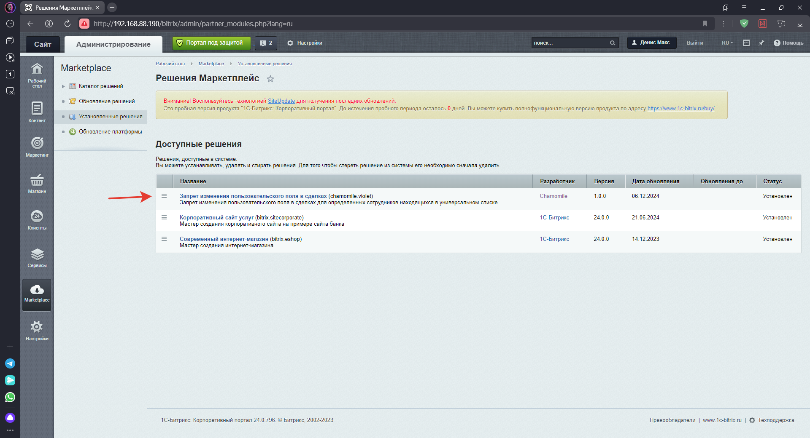
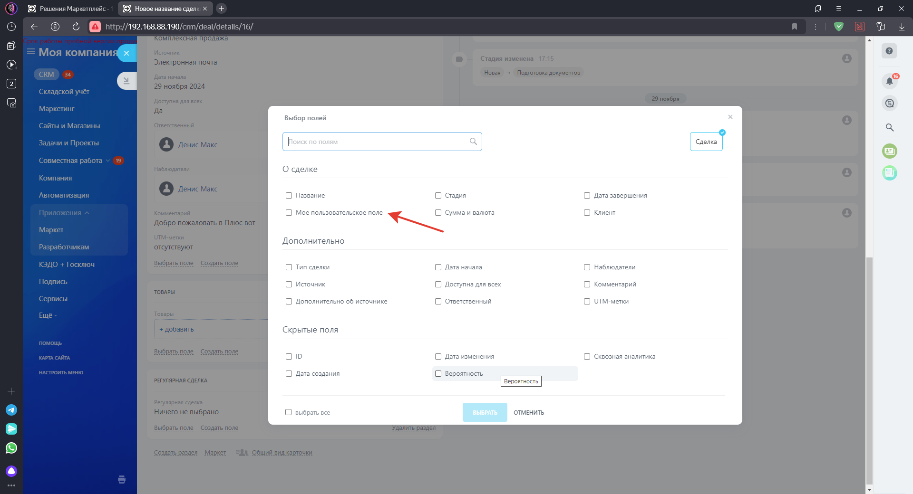
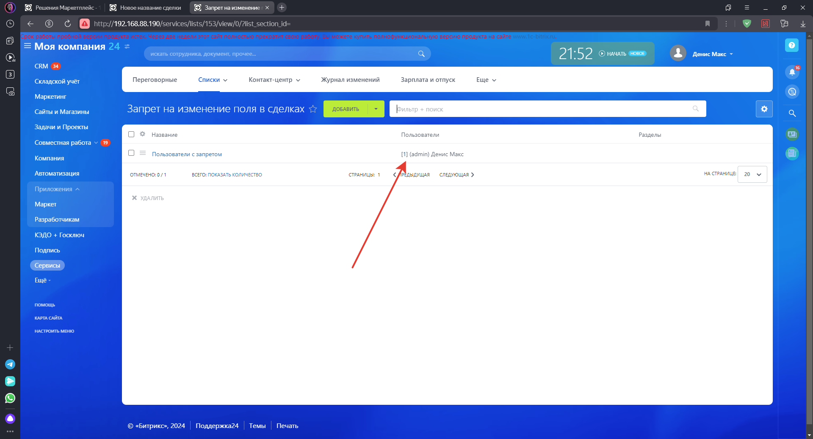
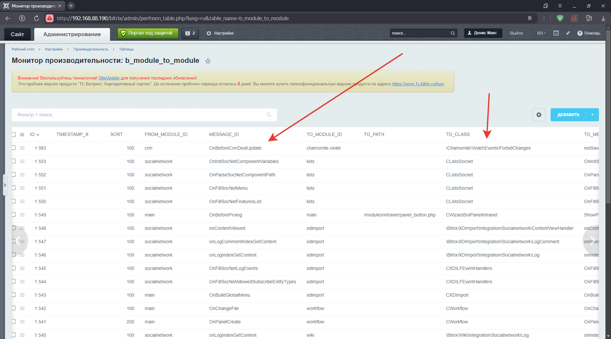

# Bitrix24-Forbidding-editing-custom-field
Запрет изменения пользовательского поля 

Модуль chamomile.violet запрещает изменение созданного модулем пользовательского поля "UF_MY_CUSTOM_FIELD" в сделке для определённых сотрудников указанных 
в универсальном списке, для всех остальных сотрудников поле работает как обычно.  
Обработка происходит при срабатывании события "OnBeforeCrmDealUpdate".  

Установка:    
Установить как обычный модуль битрик управление сайтом в разделе "Ваш сайт/bitrix/admin/partner_modules.php?lang=ru"  

Скриншоты 

    
 
 
 